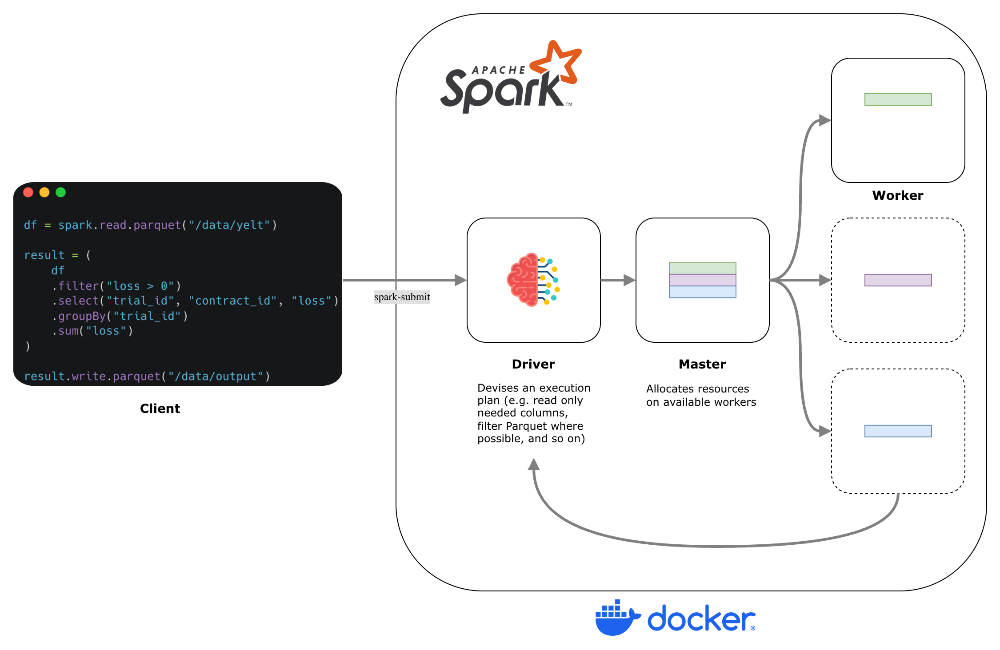

# Apache Spark - Standalone Cluster (via Docker)

## Overview

This repository outlines a 'minimal' approach for provisioning Apache Spark either on your local machine or, alternatively, on
some kind of cloud-hosted resource (e.g. EC2, Digital Ocean and so forth).

Getting started is as simple as,

```sh
make up
```
Open your browser at `localhost:8080` and you should observe an interface into the 'master' node of your Apache Spark network (details below). 

You can then *submit* spark workloads using,

```sh
make submit app=spark-example.py
```

Where the script is stored within `./spark_apps`.

## Architecture

Broadly speaking, Apache Spark leverages a traditional, intuitive [_master-slave_](https://en.wikipedia.org/wiki/Master%E2%80%93slave_(technology)) architecture.

Every cluster is equipped with a 'driver' (the brain that devises a plan based on the input model), a 'cluster manager' (the coordinator that allocates 
resources on each worker node) and one or more workers, responsible for executing tasks.

Here is a diagram which depicts this setup,

<p align="center">
    
</p>

In practice - and within the contents of this repo - we deploy tasks to the cluster in 'client mode' which effectively means that the 'driver'
is operating directly on our client machine rather than as a separate node in the cluster.

Each of the components outlined above are documented within the following respective files,

* `Dockerfile` which prescribes the base image configured with an Apache Spark distribution
* `compose.yml` which outlines how the base image (above) is adapted into different Apache Spark services (e.g. `master`, `worker` and so on)

